# Azure Entra ID & Intune IT Support Lab

A hands-on Microsoft 365 and Azure IT administration lab simulating a real enterprise environment. Built to demonstrate practical skills in identity management, access control, device compliance, and IT support workflows using Microsoft Entra ID (Azure AD), Microsoft Intune, and the Microsoft 365 Admin Center.

---

## Lab Overview

This lab simulates the IT infrastructure of a small organisation with three departments: IT Support, HR, and Finance. All configurations were performed in a live Microsoft 365 Business Premium tenant.

**Tools & Platforms Used:**
- Microsoft 365 Admin Center
- Microsoft Entra ID (Azure AD)
- Microsoft Intune
- Azure Portal

---

## What Was Built

### 1. Organisational Structure
- Created 3 Microsoft 365 department groups: `IT-SUPPORT`, `HR-Department`, `Finance-Department`
- Created 6 licensed user accounts and assigned each to their department group
- Assigned M365 Business Premium licenses to all users

### 2. Identity & Access Management
- Enabled **Security Defaults** to enforce MFA across the organisation
- Configured **Self-Service Password Reset (SSPR)** for all users — reducing helpdesk ticket load
- Created a **Conditional Access policy** (`Require MFA for All Users`) targeting all cloud apps, set to Report-only mode for safe monitoring

### 3. Role-Based Access Control (RBAC)
- Assigned the **Helpdesk Administrator** role to Sarah Mitchell (IT Support Technician)
- Demonstrates principle of least privilege — user has only the permissions needed for their role

### 4. User Lifecycle Management
- Simulated a full user offboarding workflow: blocked sign-in for a departing user (James Okafor)
- Restored access to simulate re-onboarding
- Demonstrates the standard IT detect → action → verify workflow

### 5. Device Compliance (Intune)
- Created a Windows 10/11 compliance policy: `Require Device Compliance - Windows`
- Enforced **BitLocker encryption** and **Microsoft Defender** risk score requirements
- Configured noncompliant devices to be marked immediately

### 6. Monitoring & Audit
- Reviewed **Sign-in logs** to verify admin activity and application access
- Reviewed **Audit logs** showing all changes: group membership, SSPR updates, RBAC assignments, policy creation
- Demonstrates ability to investigate security events and produce audit-ready records

---

## IT Support Scenarios Covered

| Scenario | Action Taken |
|----------|-------------|
| New employee onboarding | Created user, assigned license, added to department group |
| MFA enforcement | Enabled Security Defaults + Conditional Access policy |
| Password reset reduction | Configured SSPR for all users |
| Employee offboarding | Blocked sign-in, verified access removal |
| Re-onboarding | Restored sign-in access |
| Role delegation | Assigned Helpdesk Admin role via RBAC |
| Device compliance | Created Intune policy requiring BitLocker + Defender |
| Security investigation | Reviewed sign-in and audit logs |

---

## Skills Demonstrated

- Microsoft Entra ID (Azure AD) administration
- Microsoft Intune device compliance policy configuration
- Conditional Access policy creation and management
- Self-Service Password Reset (SSPR) configuration
- Role-Based Access Control (RBAC)
- User lifecycle management (onboarding, offboarding, re-onboarding)
- Security log review and audit trail analysis
- Microsoft 365 Admin Center user and license management

---

## Evidence Walkthrough

The screenshots below are arranged as a full IT support story, not just isolated
screens. They show how a junior Microsoft 365 / Entra ID administrator would
onboard users, assign licenses, place users into department groups, manage
account access, delegate limited admin permissions, apply MFA policy controls,
review audit activity, and begin Intune compliance configuration.

### 1. Bulk User Creation and Licensing

I started by using the Microsoft 365 Admin Center bulk user creation workflow.
This is a realistic helpdesk/admin task because new starter batches are often
prepared through CSV files instead of creating every user manually.

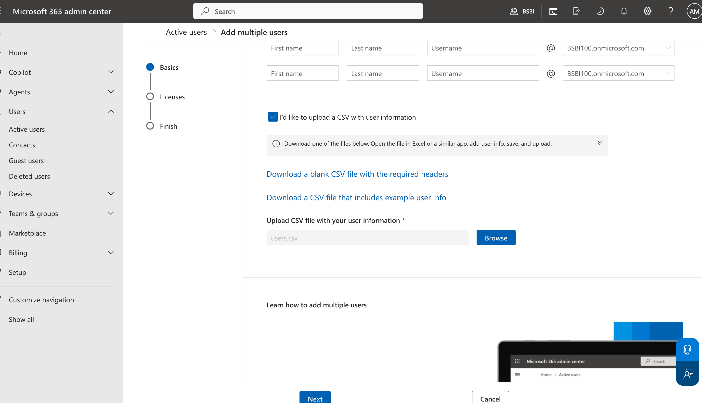

The users were assigned the Germany location and Microsoft 365 Business Premium
licenses. This proves that the accounts were not just created as empty objects;
they were prepared with the correct licensing needed for Microsoft 365 services.

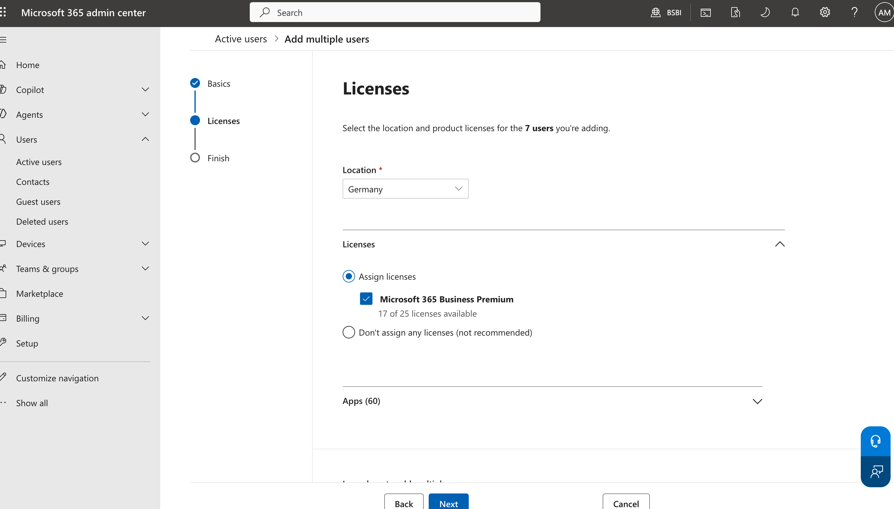

After the CSV import completed, the admin center confirmed the lab users were
created successfully. The six named accounts represent realistic employees
across IT Support, HR, and Finance.

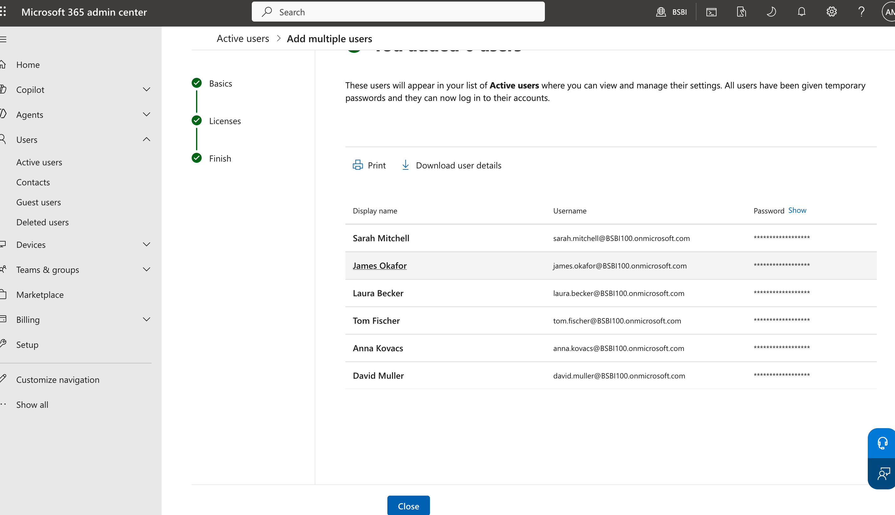

### 2. Department Group Membership

I created separate Microsoft 365 groups for each department and assigned users
based on their role. This demonstrates a common access management pattern:
users should receive access through groups rather than one-off manual
permissions wherever possible.

The IT support group contains James Okafor and Sarah Mitchell. This group
represents technical staff who may need access to support resources,
documentation, or shared operational tools.

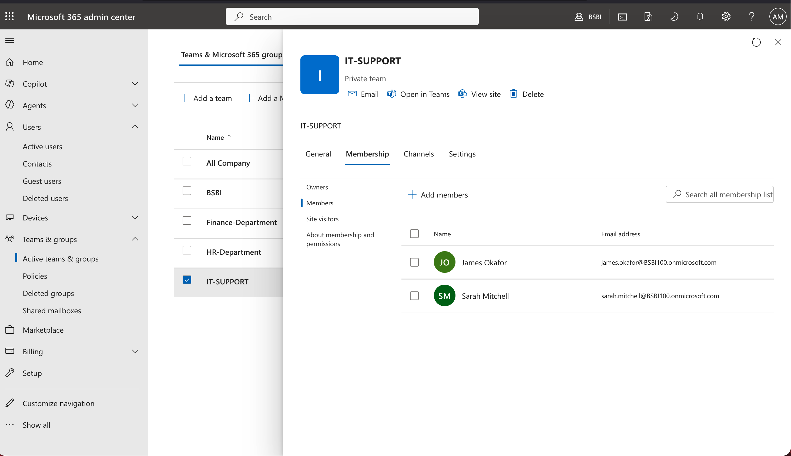

The HR department group contains Laura Becker and Tom Fischer. Keeping HR users
in a dedicated group supports cleaner access control for sensitive HR files and
team resources.

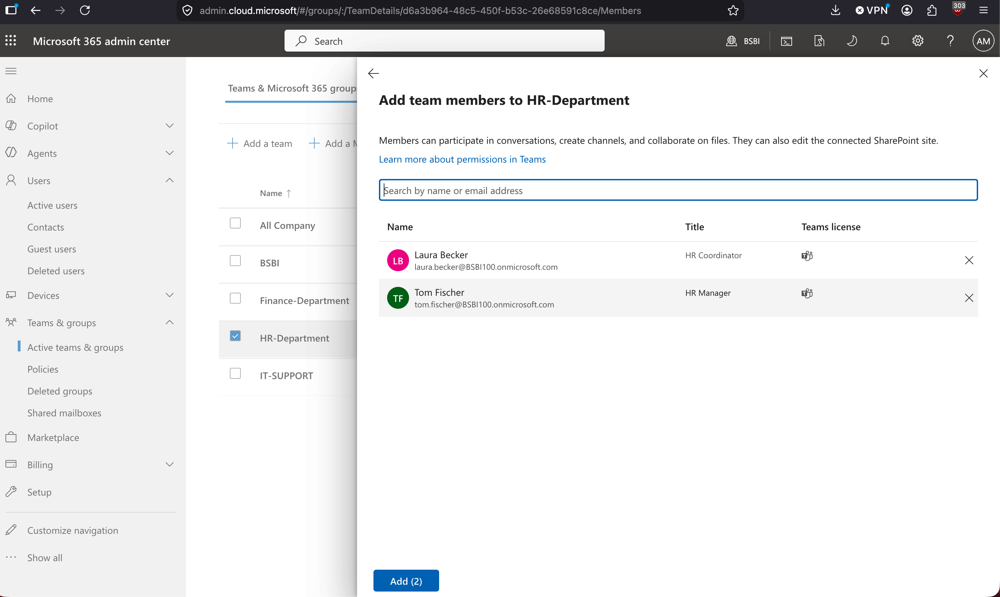

The Finance department group contains Anna Kovacs and David Muller. This
separates finance access from HR and IT support access, which is important for
least-privilege administration.

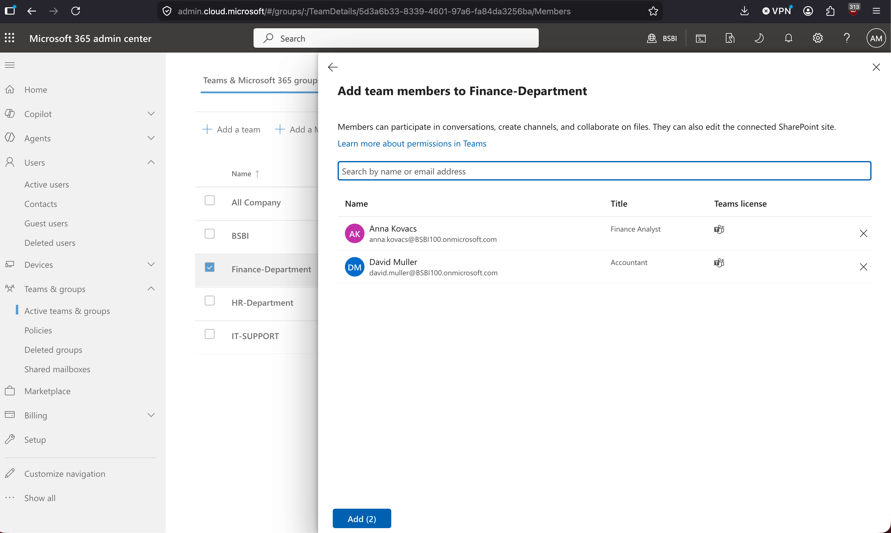

### 3. User Lifecycle: Offboarding and Re-Onboarding

To simulate offboarding or a compromised account response, I blocked James
Okafor from signing in. This is a standard first-line support/security action
when a user leaves the company or when account misuse is suspected.

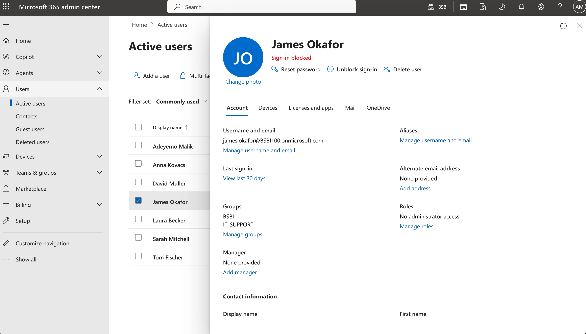

The admin center then confirmed that sign-in was blocked and that active
Microsoft sessions would be signed out. This is important because the action is
not only configured; it is visibly confirmed by the platform.

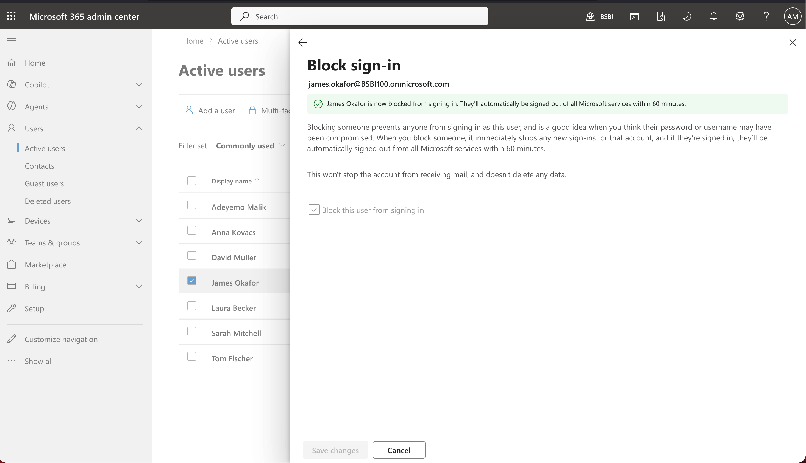

I then reversed the action to simulate re-onboarding or restoring access after
verification. This shows the full lifecycle workflow: restrict access, verify
the change, and restore access when appropriate.

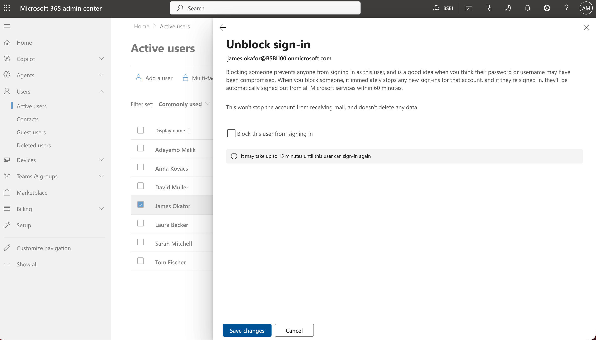

### 4. RBAC and Least-Privilege Delegation

I assigned Sarah Mitchell the Helpdesk Administrator role. This is a practical
RBAC example: a support technician receives enough permission to help users
without being given Global Administrator rights.

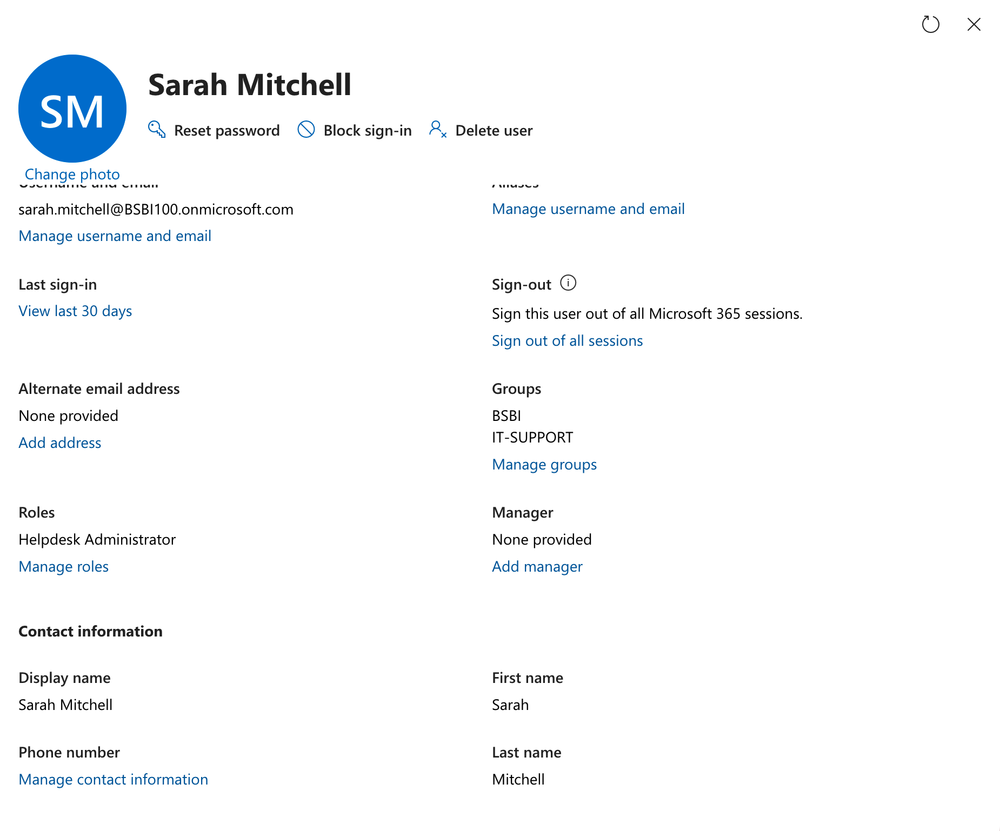

The role assignment screen shows the Helpdesk Administrator role selected under
admin center access. This demonstrates the principle of least privilege and
shows that the permission was deliberately assigned, not assumed.

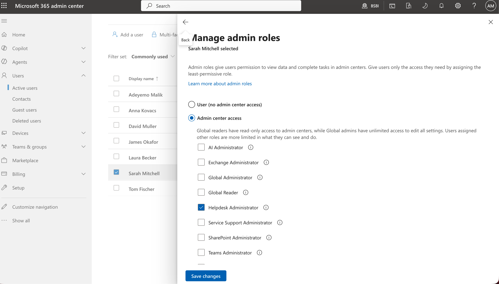

### 5. Conditional Access and MFA Control

I configured a Conditional Access policy to require multifactor authentication.
The grant control screenshot shows the key security control: access is granted
only when MFA is satisfied.

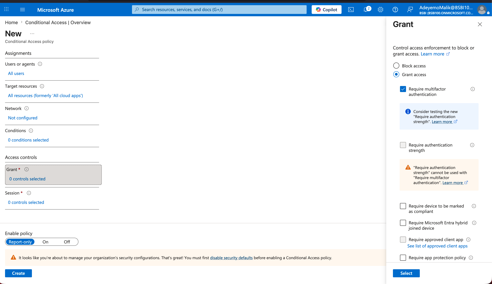

The policy targets all users and all cloud apps, but it is set to Report-only
mode. This is an important real-world safety choice: administrators can monitor
the effect of a policy before enforcing it and risking user lockout.

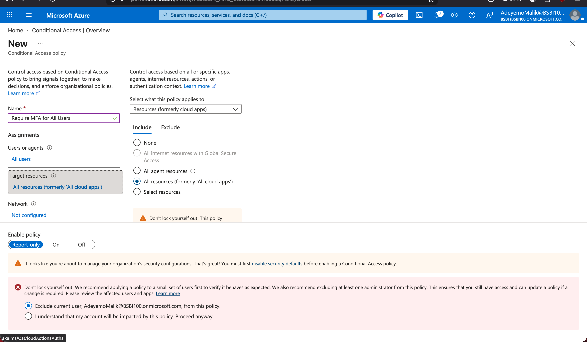

### 6. Audit Logs and Administrative Traceability

I reviewed Entra audit logs after making changes. The log view shows admin
activity such as role assignment, group membership changes, user updates, and
policy creation. This proves the lab includes not only configuration work, but
also verification and audit readiness.

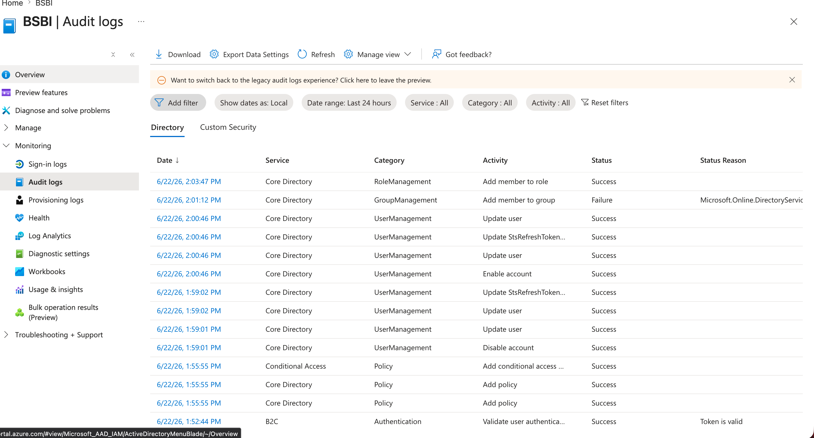

### 7. Intune Device Compliance Policy

I opened Microsoft Intune and started creating a Windows compliance policy.
This extends the lab beyond identity administration into endpoint management,
which is relevant for modern IT support roles.

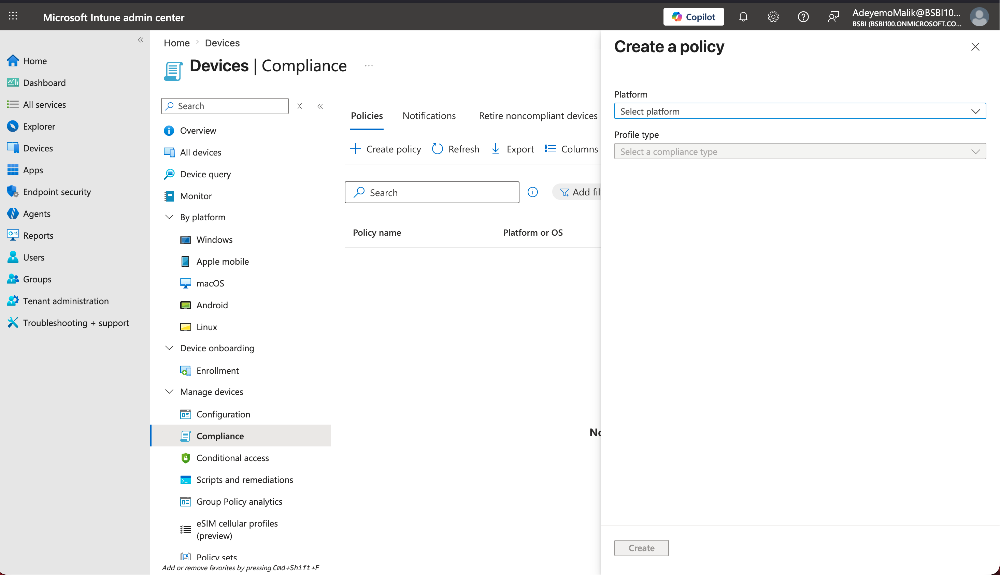

The Windows 10/11 compliance policy basics screen shows the named policy
`Require Device Compliance - Windows`. This documents the start of a compliance
baseline that can later be connected to security requirements such as
encryption, device health, and Defender risk level.

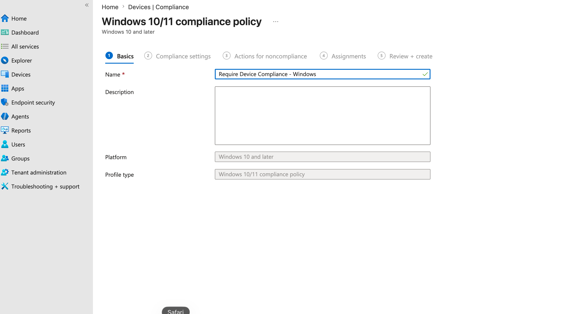

## What This Project Proves

This lab demonstrates that I can perform and document practical Microsoft 365
and Entra ID support work, including:

- creating users in bulk through the Microsoft 365 Admin Center
- assigning Microsoft 365 Business Premium licenses
- organizing users into department-based Microsoft 365 groups
- blocking and restoring user sign-in as part of account lifecycle management
- assigning a limited Helpdesk Administrator role using RBAC
- configuring Conditional Access for MFA in Report-only mode
- reviewing audit logs to confirm and investigate admin activity
- starting an Intune Windows compliance policy for endpoint governance

---

## Author

**Adeyemo Malik** — IT Support Engineer | Berlin, Germany  
[LinkedIn](https://linkedin.com/in/malik-adeyemo-a86922339) | [GitHub](https://github.com/malikadeyemo95-star)
